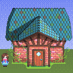
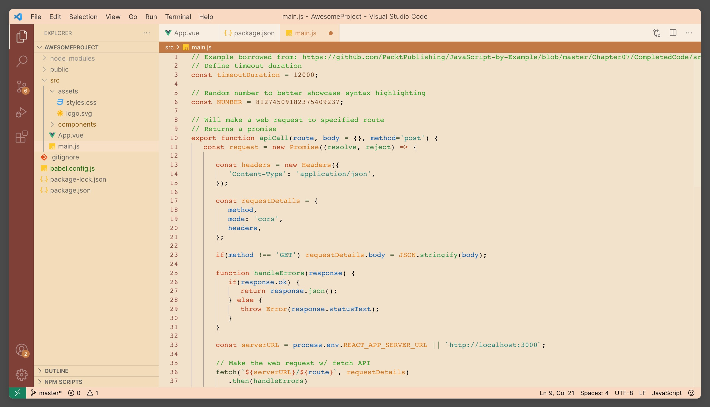

# Stardew Valley Theme

    

    Experience the tranquil charm of Stardew Valley with our new VSCode theme.

## Installation

Install this extension from the [VS Code marketplace](https://marketplace.visualstudio.com/items?itemName=zimo.stardew-valley-theme&WT.mc_id=python-17801-anthonyshaw).

OR

With VS Code open, search for `Stardew Valley Theme` in the extension panel (`Ctrl+Shift+X` on Windows/Linux or `Cmd(⌘)+Shift+X` on MacOS) and click install.

OR

With VS Code open, launch VS Code Quick Open (`Ctrl+P` on Windows/Linux or `Cmd(⌘)+P` on MacOS), paste the following command, and press enter.

`ext install zimo.stardew-valley-theme`

## Using Stardew Valley Theme

Congrats on installing joy! 

Crafted with love, our theme beautifully captures the game's vibrant colors, warm hues, and rustic simplicity. Whether you're coding the next big app or exploring data streams, let the soothing palette of the beloved farming simulation game guide your work. 

Our theme offers a harmonious blend of nostalgic aesthetics and readability, providing a coding environment that's as delightful as tending your virtual farm. Dive in, let your creativity bloom, and make every coding journey an enchanting Stardew Valley adventure.

## Thank you

If you are interested in our project, please take a look to  our [github page](https://github.com/zimo1412/stardew-valley-theme).
